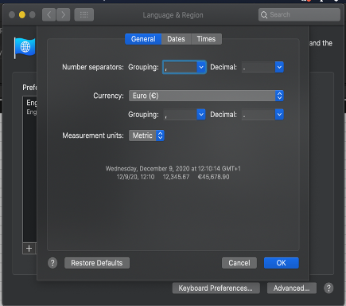
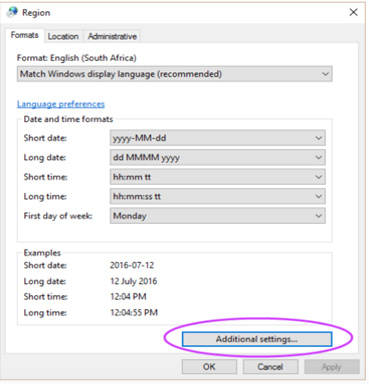
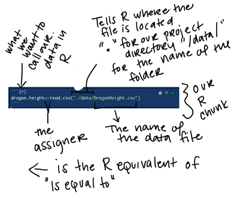
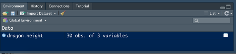
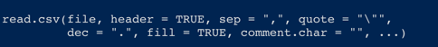

# Week 1 {#week1}

In week 1 of the course, your objectives are: 
1. Get to know the course. 
  Check out the course schedule and the assignment timing 
2. Introduce yourself 
  To me (the instructor) through the course survey
  To eachother through making your course website
3. Get to know your group. 
  You will work in groups/meta-groups throughout the course and it's important to get to know the people you will be working with. 
4. Get to know the basic principles of modeling in R 

## Day 1 - 25.4.2022 

You should have been introduced to the course website during your in person lecture this morning. 

Your first mission is to fill out this survey:![Course group survey] (https://forms.gle/uU9E7zL68f7qCFSQ9) 

We will use this survey to put you into groups so that you can best facilitate each others learning. 

Once you've filled out the form - You are going to make a website introducing yourself using RMarkdown.

You can find the files for today's assignment in the OneDrive folder for today on Teams. 

## Assignment 1 
Getting to know R  
### Topic: R Studio – A scavenger hunt 

### Learning objectives: 
1.	Be able to locate basic information in R Studio
2.	Be able to create and use R Markdown documents 
3.	Set up R projects 
4.	Load R packages
5.	Be able to find and parse R help documents 
6.	Be able to effectively find solutions to common problems on the internet 

### Background information: 
	During the practicum, we are going to use R and R studio every day. Every task that you are assigned will come in the form of an R Markdown document. Unfortunately, the best way to learn how to use R is just to try using it, so today’s mission will be in the form of a scavenger hunt that will force you to use R to solve find commonly used information, get used to the interface, and play around with R a bit. Throughout the day, we will be using information from this website: [R helper website](http://milton-the-cat.rocks/learnr/r/r_getting_started/#section-overview)
	
	You don’t have to go through all of the materials there but they are all super useful for getting started in R and may provide you with some additional help if you get a bit stuck. 
	
### Section 1: Creating an R markdown document, getting to know the R studio interface, and adapting R studio to meet our needs. 

Watch this video - 

Complete the following tasks - 
1.	Rearrange your windows in R studio to your liking 
2.	Figure out your optimal color arrangement 
3.	Take a screenshot of your R studio arrangement
4.	Make a project file for this course called “Ecological Theory and Application” in a new working directory. This project can be on your local hard drive or on a cloud service like google drive.
5.	Make a folder in your project directory for data - each day you are going to copy the materials from my One Drive folder into your project working directory. 
6.	Create an R markdown document in your personal Day 1 folder (not the course one) 
7.	Check the R studio preferences for your R Studio. 

### Section 2: Installing packages 
1.	Watch this video  
 - You can stop watching at about 11:36 minutes in. 
2.	Install the package “tidyverse” 
3.	Create a set up code chunk 
4.	Load the package “tidyverse” 
5.	Using google – find the documentation for the “Tidyverse” package 
6.	Take a screenshot of the documentation 

### Section 3: R Markdown 
We are going to be using R markdown in this course. You don’t need to be able to do anything fancy with it but I find it really helpful to be able to keep all of my information together for projects until they get to be pretty advanced. Once you’ve completed your tasks for the day, you’re just going to save the document and put it into the folder labelled "To Submit" in the One Drive folder for that day. You can put notes in there for me and our student assistents. 

1. Watch this video 
2.	Make an “about me” R Markdown file for yourself – Linnea and I have included our examples for you to take a look at in today’s google drive folder
3.	Be sure to include the following sections with headings: 
    a.  	A summary of who you are, where you are from including where you did your BSc degree, what your focus was, and a picture of yourself     b.	Your scientific interests 
    c.	Your experience in R, with stats in general 
    d.	Your hobbies 
4.	At the end of this document – add a section called “The adventures in R that I have had today” include: 
  a.	Your screenshot of your R Studio interface 
  b.	Your screenshot of the documentation of the tidyverse package 

### Section 4: Loading data, getting help, writing basic commands 

We are going to be using R to do a lot of things but there are three basic things that you are going to do almost every day: load data, use the help function, and try to solve problems. Usually we are going to keep all of our documentation and assignments in an R markdown file for each day but today you will be typing in commands into your R markdown file that you created as an “about me” instead. 

R does a lot of things really well and for the most part we are going to use R to work with data but it’s rather cumbersome to enter data in R. The most common way to handle this is to do basic data entry in Excel and then all of our data manipulation and statistics in R. If we do the manipulation in R then we always have a record of what we’ve done. This increases the repeatability of it but also the transparency of our data manipulation. If you do your data manipulation in excel – you might forget that you log transformed a variable. If you do this in R – the record is always there and you can easily send the file to your advisor and they can see that you have/have not transformed your data. 

* Important - COPY THE FOLDER called "data" into your project directory *

Data that you’ve entered into Excel has to be formatted properly to  be read by R. R easily reads files that are saved as a .csv file. But .csv files have lots of formats – to avoid issues between all of our different R’s and excels – before you ever load data into R, we need to check our data format. The majority of science is done with a period (.) as the decimal marker and the comma (,) as the thousand separator. This is also R’s default but depending on where you bought your computer – it may not be the default on your computer. To change this:
1.	In your computer under language and region settings – on my computer it looks like this: 
2.  On a windows computer, it will look like this: 

The command that we use to read data into R most often is read.csv(). Read.csv() is made to deal with .csv documents. If you have your settings properly set then all you need to do is tell R what the name of the file is and where to find it. Because we have our R project set up and the csv file properly saved this is pretty easy. 

Once we’ve got our data read in – it appears in our global environment: 

### Section 5: Getting help in R

One of the most helpful tools in R is the help() documentation. For any command you can ask for help from R in two ways: 
1.	help(name of the command) 
2.	?name of the command 

The anatomy of an R help file: 

All R help files are formatted in the same way. They don’t always have all of the sections but they always follow the same general pattern. 

Some commands are similar enough that they are grouped together or they are different versions of the same thing. For example, the read.csv() help file shows you the results for read.table() because read.csv is a specific version of read.table()

The main pieces that we care about are: 

Description – tells you what the command does 

Usage – shows you what the command looks like and the different parts of the command. But this doesn’t mean we have to use every part. If you think about our read.csv() example, we only used one part – the name of the file. This is because we made the format of our data match the default values for the rest of the command. Anything you don’t specify with an argument uses the default. The defaults are given in the usage of the help file. 
For read.csv() it looks like this: 

These are the arguments we can specify where the defaults for read.csv() are different than for read.table(). The “…” at the end tells us that we can use any of the arguments from read.table(). 

Arguments – these are the options for things we can specify with a description of what can be done with each one. 

Examples – Gives you examples of the command in action that you can adapt for your own script. 

Take a moment to look at the help documentation for the following commands: 
Read.csv()
Rm()
Help() 

Some R problems are really common – so common in fact that R Studio has cheat sheets for them. You can find them in the help menu in the tool bar. I have printed copies of these taped up behind my desk because I reference them so frequently. 

Another major way you can get help on an R problem is just by googling, the best search terms for finding solutions are pretty specific, my go to formulas are: 
-	When I get an error – Copy/pasted error message + R + What I was trying to do 
-	When I’m trying to do something specific – What I am trying to do + R 
-	When I am having trouble figuring out a command – command name + R + package name 

A lot of the things you will find will be places like StackOverflow – which focus on reproducible examples that you can then use in your code. Focus on answers that have lots of upvotes! 

A final addition to your R markdown document: 
You’ve received the following error – 

 How do you fix this issue? 
 
*Don't forget to save your .Rmd file into today's folder labeled "To Submit"!!*

To do's before Friday: work through the section labeled "the game" with your assigned group. 

## The Game 

Objectives – 
1.	Get to know each other, break the ice! 
2.	Think through the consequences of competition for human interactions
3.	Understand how cooperation changes the competitive dynamics 
4.	Understand how the initial distribution of resources influences competitive dynamics 
5.	Understand how chance influences competitive dynamics 

“Survival of the fittest” is a core principle of modern biology. Resources are limited. Individuals compete for those limited resources. In nature – the ones that can’t compete die. Between species, competition works the same way. Species that compete better, grow faster and are able to get more resources. This principle is the baseline of ecological thought. We assume that species competition underlies all ecological communities. The theory of competition in Ecology comes entirely from models that were meant to describe humans. The first models of competition were developed by philosophers and economists who were trying to understand human population growth. They described competition among individuals for limiting resources as the predominant limiting factor for populations.  

You are going to examine how competition between individuals structures societies as a group through a game of Settlers of Catan. We will discuss this case-study and extend it further to modern social and ecological systems in class on Friday. 

### Step 1 - Getting to know the game 
1.	Go to ![online free settlers of catan] (www.colonist.io)  
2.	Create a room 
3.	Invite your group mates to join you, set the game up so that it is private and hop onto the video chat platform of your choice
4.	Set up a tutorial game and play through it as a group
5.	Once you’ve played through the tutorial. Set up a private game. 
6.	Take a screenshot of your starting map and save it for future reference. 
  *Would you say that the resources are evenly distributed across the game board? Are there resource hotspots?* 

7.Play through the game. 
8.	At the end of the game screenshot the results of your game and answer the following questions 
  a.)	Who in the group do you perceive to be the strongest competitor? 
  b.)	Why? Do they have the most total resources? Did they specialize on a single resource? 
  c.)	What role does luck play in the game? 
  d.)	What role does the starting distribution of the resources play in the game? 
  e.)	Why do you think that the winner won? 
  f.)	How did competition play out in this game? Did all players compete with other equally or were their biases in who competed with who?

### Step 2: Making competition stronger. 

Now – you are going to repeat the game but this time – you cannot trade with your fellow players. 

*Don't forget to screenshot the starting map and end results, we will use these on Friday* 

At the end of the game answer the following questions 
  a.)	Who in the group do you perceive to be the strongest competitor? 
  b.)	Why? Do they have the most total resources? Did they specialize on a single resource? 
  c.)	What role does luck play in the game? 
  d.)	What role does the starting distribution of the resources play in the game? 
  e.)	Why do you think that the winner won? 
  f.)	How did refusing to trade change the game? 
  g.)	How did competition play out in this game? Did all players compete with other equally or were their biases in who competed with who? 

## Day 3 - 29.4.2022 
1. Watch the lecture - 
2. Discuss with your group:
    a.) How do you think competition interacts with your daily life?
    b.) Do you think competition has an overall positive or negative impact on your life? 
    c.) How does competition structure Dutch society? Think of one discrete example.
        For example - Does competition influence interactions inside universities in the Netherlands?
        How does competition in this example influence the distribution of resources?
    d.) Can you think of cultures that have more competitive versions of the example you came up with? How does the increased competition influence the distribution of resources in this example? 
    e.) Can you think of cultures that have less competitive versions of the example you came up with? How does the lessened competition influence the distribution of resources in this example? 
3. As a group - work through the Rmarkdown file in the One Drive for today labeled "Day3-ModelingCompetitionInR.Rmd".

