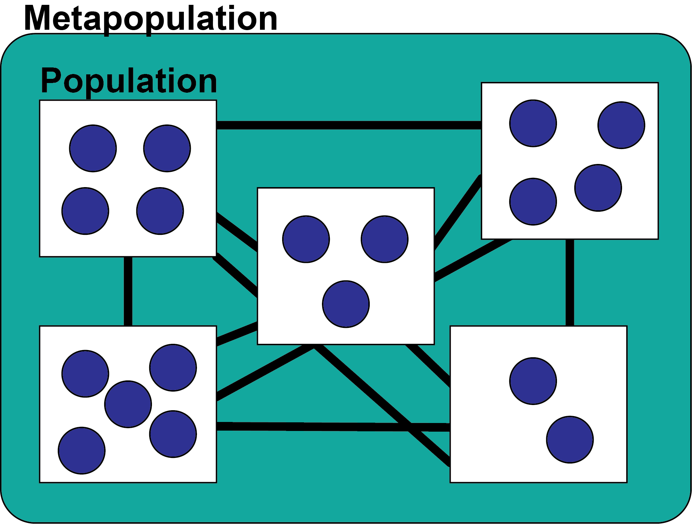

**LEARNING GOALS** Today we have two goals:
1. Understand how connectedness can change the dynamics of a population 
2. Develop hypotheses for populations that are connected vs. unconnected

```{r setup, include=FALSE}
knitr::opts_chunk$set(echo = TRUE)
library(primer)
```

### Part 1: Review 

Let's think back to the beginning of the course where we focused on a single population of individuals. We used the function clogistic() to model single species population dynamics. 

This function had two parameters: 
r - the rate of population increase or birth rate 
alpha - the self limitation coefficient or intraspecific competition coefficient 

```{r reviewing single population growth}
y0<-c(1)

#the time points that the model will run for
t<-0:100

#setting the parameters
p<-c(r=0.1, alpha=0.2)

#note that I have changed the func to "lvcomp2" this is the function for competition in this package
out <- ode(y=y0, times=t, func=clogistic, parms=p)

plot(out)
```

This function models our population in isolation. Individuals are being born but no additional are coming in via other methods and no individuals are leaving. This model thinks of a population as an isolated group of individuals. 

### Part 2: Introducing the meta-population 

Outside - groups of species are connected to each other. 

For example: 


In order to model this in R, we use the function "hanski". This is a meta-population model where all populations are connected. We still need to give the function four pieces of information: 
- y0 -the starting fraction of the population (between 0 and 1)
- t -how long to run the model for 
- ci - the rate of immigration (think IN migration)
- e - the rate of emigration (think OUT migration)

```{r making a metapopulation}

#the fraction of the starting population size 
y0<-c(0.1)

#the time points that the model will run for
t<-0:100

#setting the parameters
p<-c(ci=1, e=0.5)

#running the model
out <- ode(y=y0, times=t, func=hanski, parms=p)

plot(out)
```

Play around with a few different values of ci and e. 

*Questions* 
1. What happens when you increase ci alone? 
2. What happens when you increase e alone?
3. What happens when e is greater than ci? 

### Part 4: Disconnecting our metapopulations 
One of the largest causes of biodiversity loss is land use change. The way that land use change causes biodiversity loss is through habitat fragmentation which decreases connectivity between populations within a meta-population. This can cause an extinction vortex as these small populations decrease in size and genetic diversity until local extinction. 

We can add this to our model by adding in the parameter *D*. D is habitat destruction. When D is high our population loses connection to our meta-population. 

```{r adding in habitat desctrubtion}
#the fraction of the starting population size 
y0<-c(0.1)

#the time points that the model will run for
t<-0:100

#setting the parameters
p<-c(ci=1, e=0.5, D=0.5)

#running the model
out <- ode(y=y0, times=t, func=lande, parms=p)

plot(out)
```

Play around with different values of ci, e, and D. 

*Questions* 
1. What happens when D is high? 
2. How does this relate to connectedness across a landscape? 
3. Imagine two different animals scattered in populations across a landscape with fences. One of those animals can fly. The other one can't. What would be your hypothesis about how these populations will change over time? 

