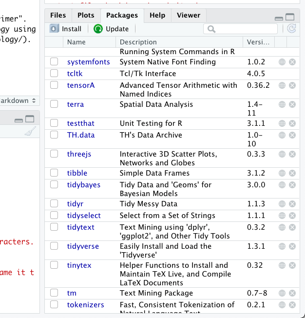

**LEARNING GOALS** We have three major learning goals for today: 
1. Get used to working with R Markdown for the assignments in the course. 2. Get used to working with data in R 
3. Create your first ecological model in R

##Part 1: Some notes on the tutorials included in this course. 

1. R code is  always presented as a gray box like this one:  

```{r setup, include=FALSE}
knitr::opts_chunk$set(echo = TRUE)

```

## R Markdown

This is an R Markdown document. Markdown is a simple formatting syntax for authoring HTML, PDF, and MS Word documents. For more details on using R Markdown see <http://rmarkdown.rstudio.com>.

When you click the **Knit** button a document will be generated that includes both content as well as the output of any embedded R code chunks within the document. You can embed an R code chunk like this:

```{r cars}
summary(cars)
```

## Including Plots

You can also embed plots, for example:

```{r pressure, echo=FALSE}
plot(pressure)
```

Note that the `echo = FALSE` parameter was added to the code chunk to prevent printing of the R code that generated the plot.

## Part 2: Dealing with data in R

### Data types 

There are three main types of data that we will work with in R. 
1. Numeric 
2. Logical 
3. Character 

You can always ask R what kind of data you have by using the command mode(). 

**Numeric data**
Numeric data is composed of numbers. 

```{r numericdata}
x<-10
mode(x)
```

**Logical data** 
Logical data is always TRUE or FALSE. This can also be shortened to T or F. 

```{r logicaldata}
y<-TRUE
mode(y)
```


**Character data**
Character data is composed of letters and symbols that R can't read as numbers. We represent this type of data by putting it in quotation marks. When we combine characters in a variable, we call this a "string". 

```{r characterdata }
z<-F
mode(z) #I didn't use quotation marks here! So R confused it for a logical 

z<-"F"
mode(z)

z<-"fool"
mode(z)
```

*Note* You can use either double quotation marks, "likethis", or single quotation marks, 'likethis'. Just be consistent. 

### R as a calculator - basic operators and functions

R can act as a basic calculator. 

**<-** - Assigns data to a data structure, can be interpreted as "is equal to"  
**+** - Performs addition  
**-** - Performs subtraction  
**+, -, *, /, %, ^,** - Perform basic arithmetic like addition, subtraction, multiplication, and division, meaning is the same as on your computer keyboard  

For example:  
```{r basicarithmetic}
3+4     # sum
3-4     # difference
3*4     # product
3/4     # division
3^4     # power
1+2*3   # multiply sign is normally executed before sum sign...
(1+2)*3 # ...unless you use brackets
2^3*3   # power sign is normally executed before multiply sign...
2^(3*3) # ...unless you use brackets
sqrt(9) # square root
exp(3)  # e to the power 3
log(3)  # natural  logarithm of 3
log(exp(3)) 
log10(100)
```

We can also do the same thing with variables that have been given a value with the assignment operator, **<-**   

```{r assigningvaluestoobjects}
a <- 1 # we assign the value 1 to an object called a
a      # as we can see, a has the value 1
a + 6  
```

* Reproducibility tip: One of the best ways to make sure that your work is reproducible is to do as much of your basic calculations and data manipulation in R as possible. This keeps a record of every function that you apply to your data. We usually keep a separate R file with all of the data manipulation and basic math and then save the final file for our future data analysis. 

## Part 3: Loading packages in R 

For our modeling endeavors - we are going to use the package "primer". this package was made to go along with the book "Primer of Ecology using R" .

There are two ways to install a package in R.

1. In the package tab of R studio. 

 - Here you can click install, Type in the name of the package you would like to install and then install it, you can do this for the primer package now. 
2. Using the console (below), you can type in: install.packages("package.name"). 

Once the package is installed - we have to tell R that we want to use it. 

```{r loading the primer package}
library(primer)
```

Once the package is loaded - we have access to all of the functions included in that package. 

We are going to use this package to model competition and facilitation. You can find more information about competition and facilitation here: 

As you know from lecture, we assume that the growth of a population depends on the amount of a population that already exists. This is called *density-dependent growth*. 

Density dependent growth means that the growth of a *population* depends on three things: 
1. N - The number of individuals that are in a population. 
2. r - the species growth/reproduction rate. r can be any number, small values mean that the population grow slowly (think whales). Large numbers mean that the population grows quickly (think rabbits). 
3. alpha - the effect of an individual on its population, can be a number from 0 to 1 (we will talk about negative values later). Larger values indicate strong limitation. Smaller values indicate weak limitation. 

Alpha is often also called the "competition coefficient". When we are talking about a single species - alpha shows us how limiting that species is on itself (inTRAspecific competition). When we are talking about multiple species, each species has an alpha for itself and for the other species it is around (inTERspecific competition). 

If we want to show what happens in a population in isolation - we can use the command - clogistic() from the primer package. 

It needs three inputs: 
y - N - the number of individuals in the population to start 
t - the number of units time we want to run our simulation for 
p - the parameters that we are giving our model
  in this case alpha and r 

```{r parameterizing a simple logistic model}
#our starting number of individuals
y0<-c(N=1)

#the number of units time we want to go for 
t<-0:20

#our parameters 
p<-c(r=1, alpha=0.0001)

```

In this case - we are telling our model that we want it to grow with perfect replacement (each individual produces one more individual) and with weak self limitation. 

```{r running our model and looking at the result}
#running the model 
out <- ode(y=y0, times=t, func=clogistic, parms=p)

#looking at the first five rows of the results
out[1:5,]
```

```{r plotting the output}
plot(out)
```

### Questions for discussion: 
1. What happens at the following time points: 
  a.) Time 5
  b.) Time 10 
2. What is the carrying capacity for our population? 

### Changing the parameters in our model 
Our next mission is to play around with different values of N, r, and alpha. 

#### Step 1 - Change each parameter individually. 

Try out 5 different values of N. 

Using the code below - try 5 different values of N. 

```{r changing values of N}
#our starting number of individuals
y0<-c(N=1)

#the number of units time we want to go for 
t<-0:20

#our parameters 
p<-c(r=1, alpha=0.0001)

#running the model 
out <- ode(y=y0, times=t, func=clogistic, parms=p)

plot(out)
```

Questions: 
1. How does changing N change what your plot looks like? 
2. What would this mean if we were talking about a population of elephants or rabbits? 

Do the same thing for r.

Using the code below - try 5 different values of r. 

```{r changing values of r}
#our starting number of individuals
y0<-c(N=1)

#the number of units time we want to go for 
t<-0:20

#our parameters 
p<-c(r=1, alpha=0.0001)

#running the model 
out <- ode(y=y0, times=t, func=clogistic, parms=p)

plot(out)
```

Questions: 
1. How does changing r change what your plot looks like? 
2. What would this mean if we were talking about a population of elephants or rabbits? 

Do the same thing for alpha.

Using the code below - try 5 different values of alpha. 

```{r changing values of alpha}
#our starting number of individuals
y0<-c(N=1)

#the number of units time we want to go for 
t<-0:20

#our parameters 
p<-c(r=1, alpha=0.0001)

#running the model 
out <- ode(y=y0, times=t, func=clogistic, parms=p)

plot(out)
```

Questions: 
1. How does changing alpha change what your plot looks like? 
2. What would this mean if we were talking about a population of elephants or rabbits? 
3. Which parameter had the largest impact on where the growth curve changes? 
4. Which parameter had the largest effect on the overall shape of the growth curve? 