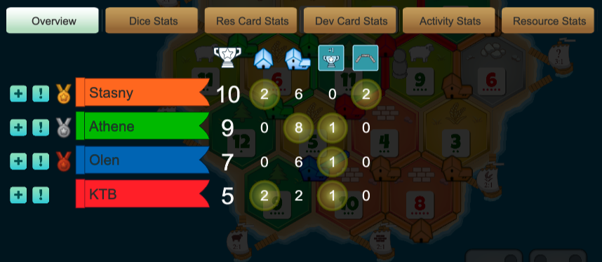

**LEARNING GOALS** We have two major learning goals for today: 
1. Take our model from Friday and turn it from intrAspecific to intERspecific. 
2. Go from thinking only about competition to thinking about facilitation. 

*NOTE* I will always start our code with a set-up chunk. This will include all the packages for the day and any data that you need to use. 
```{r setup, include=FALSE}
knitr::opts_chunk$set(echo = TRUE)
library(primer)
```

### Part 1: Reviewing our population model 

On Friday - we built a simple model of a population. That model had three parts - 
1. N - the number of individuals that our population starts with. 
2. r - the growth rate of our population 
3. alpha - the self-limitation factor or competition coefficient. 

We created this model in R using the code below: 
```{r reviewing our population model}
y0<-c(N=1)

#the number of units time we want to go for 
t<-0:20

#our parameters 
p<-c(r=1, alpha=0.0001)

#running the model 
out <- ode(y=y0, times=t, func=clogistic, parms=p)

plot(out)
```

Today, we are going to force our species to interact. 

### Part 2: Forcing our species to interact. 

When we talk about communities, we have to talk about two species. Species 1 and species 2. Each species has it's own N, r, and alpha. For N and r, we can just call them N1 (or N2) and r1 (or r2) depending on which species we are referring to. But alpha is special because in a community each species has two alphas, for species 1: 
  - alpha11 - is the self-limitation rate, like we had in our model from Friday. This is the amount that a species limits itself. 
  -alpha12 - is how limiting species 2 is on species 1. So alpha12 is high if species 2 is a much stronger competitor than species 1. Alpha12 is low then 2 is a weak competitor. 
  
We can do this in R very similarly to how we did our population model but now we half to provide parameters for all of our populations and alphas:
```{r modeling competition between two species in R}
#starting both populations at 0 individuals
y0<-c(1,1)

#the time points that the model will run for
t<-0:100

#setting the parameters
p<-c(r1=1, r2=0.1, a11=0.2, a12=0.1, a21=0.02, a22=0.01)

out <- ode(y=y0, times=t, func=lvcomp2, parms=p)

plot(out)
```

Instead of having one plot - we have two plots! Species 1 on the left and species 2 on the right. 

Questions:
1. Tell the story of our two species. What happens to them through time? 
2. How do their values for r1 and r2 relate 
3. How do their values for alpha 11 and alpha 22 relate? 
4. How do their values for alpha 12 and alpha 21 relate? 
5. What does this tell you about their competition? 
6. Can these species coexist?

### Part 2: Using your gameplay examples to play out competition 

Over the past two weeks, you've played through the game colonist.io three times with three different scenarios: 
1. Baseline 
2. No cooperation 
3. Lots of cooperation 

We are going to use this game play to create competition scenarios. Starting with the first scenario. 

From each game play - you should have two screenshots. 

The first should look like this: 


This is the overall stats from your game. These stats tell us how many points they received from different types of buildings and roads. This is kind of like the growth rate of the player or "how fast were they able to colonize the board?". For the top player and the bottom player, we are going to calculate their r (growth rate) as the total number of points for the player divided by the total number of points in the game. 

I've filled in the code for my example in the picture but you should adapt it for your own group.
```{r calculating r for our baseline competition}
r.p1<-10/31
r.p4<-5/31
```

The other pieces that we have to calculate are our alphas. 

For each player - their competition rate with themself is essentially the number of spaces that they occupy in the game relative to the total number of spaces in the game. We  are going to set these equal because each player starts off occupying the same number of spots on the game board. So we are going to say that this is 0.0001 for all players.

```{r calculating alpha11s for baseline scenario}
alpha.p1.p1<-0.0001
alpha.p4.p4<-0.0001
```

For each of our players we are going to calculate their interspecific alphas using the resource stats screenshot. . 

We are going to calculate interspecific alphas as the proportion of the total resource cards that a player received in the game to the total number of cards in the game. 

```{r calculating alpha12s for baseline scenario}
alpha.p1.p4<-35/344
alpha.p4.p1<-105/344
```

Now we can model competition between our two players: 
```{r parameterizing the model with our values}
#starting both populations at 1 individual
y0<-c(1,1)

#the time points that the model will run for
t<-0:100

#setting the parameters
p<-c(r1=r.p1, r2=r.p4, a11=alpha.p1.p1, a12=alpha.p1.p4, a21=alpha.p4.p1, a22=alpha.p4.p4)

#note that I have changed the func to "lvcomp2" this is the function for competition in this package
out <- ode(y=y0, times=t, func=lvcomp2, parms=p)

plot(out)
```

Questions: 
1. What happens to each of our two players? 
2. Which player would "win the game" based on this figure? 

### Part 3: The extreme competition scenario

Repeat the procedure above but this time for the scenario with stronger competition (where you were unable to trade cards). 

I've filled in the code for my example in the picture but you should adapt it for your own group.
```{r calculating r for our baseline competition}
r.p1<-10/31
r.p4<-5/31
```

The other pieces that we have to calculate are our alphas. 

For each player - their competition rate with themself is essentially the number of spaces that they occupy in the game relative to the total number of spaces in the game. We  are going to set these equal because each player starts off occupying the same number of spots on the game board. So we are going to say that this is 0.0001 for all players.

```{r calculating alpha11s for baseline scenario}
alpha.p1.p1<-0.0001
alpha.p4.p4<-0.0001
```

For each of our players we are going to calculate their interspecific alphas using the resource stats screenshot. . 

We are going to calculate interspecific alphas as the proportion of the total resource cards that a player received in the game to the total number of cards in the game. 

```{r calculating alpha12s for baseline scenario}
alpha.p1.p4<-35/344
alpha.p4.p1<-105/344
```

Now we can model competition between our two players: 
```{r parameterizing the model with our values}
#starting both populations at 1 individual
y0<-c(1,1)

#the time points that the model will run for
t<-0:100

#setting the parameters
p<-c(r1=r.p1, r2=r.p4, a11=alpha.p1.p1, a12=alpha.p1.p4, a21=alpha.p4.p1, a22=alpha.p4.p4)

#note that I have changed the func to "lvcomp2" this is the function for competition in this package
out <- ode(y=y0, times=t, func=lvcomp2, parms=p)

plot(out)
```

Questions: 
1. What happens to our two players? 
2. Does increasing competition increase the capacity of our players to survive the deadly world of colonist.io?

### Part 4: The cooperative scenario

Repeat the procedure above but this time for the scenario with stronger cooperation (where you tried to coordinate so that everyone received resources). 

I've filled in the code for my example in the picture but you should adapt it for your own group.
```{r calculating r for our baseline competition}
r.p1<-10/31
r.p4<-5/31
```

The other pieces that we have to calculate are our alphas. 

For each player - their competition rate with themself is essentially the number of spaces that they occupy in the game relative to the total number of spaces in the game. We  are going to set these equal because each player starts off occupying the same number of spots on the game board. So we are going to say that this is 0.0001 for all players.

```{r calculating alpha11s for baseline scenario}
alpha.p1.p1<-0.0001
alpha.p4.p4<-0.0001
```

For each of our players we are going to calculate their interspecific alphas using the resource stats screenshot. . 

We are going to calculate interspecific alphas as the proportion of the total resource cards that a player received in the game to the total number of cards in the game. 

```{r calculating alpha12s for baseline scenario}
alpha.p1.p4<-35/344
alpha.p4.p1<-105/344
```

Now we can model competition between our two players: 
```{r parameterizing the model with our values}
#starting both populations at 1 individual
y0<-c(1,1)

#the time points that the model will run for
t<-0:100

#setting the parameters
p<-c(r1=r.p1, r2=r.p4, a11=alpha.p1.p1, a12=alpha.p1.p4, a21=alpha.p4.p1, a22=alpha.p4.p4)

#note that I have changed the func to "lvcomp2" this is the function for competition in this package
out <- ode(y=y0, times=t, func=lvcomp2, parms=p)

plot(out)
```

Questions: 
1. What happens to our two players? 
2. Does increasing cooperation increase the capacity of our players to survive the deadly world of colonist.io?
3. What do you notice about our values for the interspecific alpha between these different scenarios? Does cooperation increase or decrease alphas? Does it bring them closer together? 

###Part 5: Facilitation as a special case

Facilitation happens when species interactions are positive rather than negative. 

We can change this very simply in our model by changing the sign of our interspecific alphas from positive to negative. 


```{r modeling facilitation between two species in R}
#starting both populations at 0 individuals
y0<-c(1,1)

#the time points that the model will run for
t<-0:100

#setting the parameters
p<-c(r1=1, r2=0.1, a11=0.2, a12=-0.1, a21=-0.02, a22=0.01)

#note that I have changed the func to "lvcomp2" this is the function for competition in this package
out <- ode(y=y0, times=t, func=lvcomp2, parms=p)

plot(out)
```

Questions:
1. Tell the story of our two species. What happens to them through time? 
2. How do their values for r1 and r2 relate? 
3. How do their values for alpha 11 and alpha 22 relate? 
4. How do their values for alpha 12 and alpha 21 relate? 
5. What does this tell you about their facilitation? 
6. Can these species coexist?

Play out a few different scenarios for facilitation: 
1. Where one species is a strong facilitator (high negative alpha12) and one is a strong competitor (high positive alpha 21)
2. Where one species is a strong facilitator (high negative alpha12) and one is a weak competitor (low positive alpha 21)
3. Where one species is a weak facilitator (low negative alpha 12) and one is a weak competitor (low positive alpha 21)
4. Where one species is a weak facilitator (low negative alpha 12) and one is a strong competitor (high positive alpha21)

Under which scenarios do both species survive? What does this tell us about competition and facilitation?

