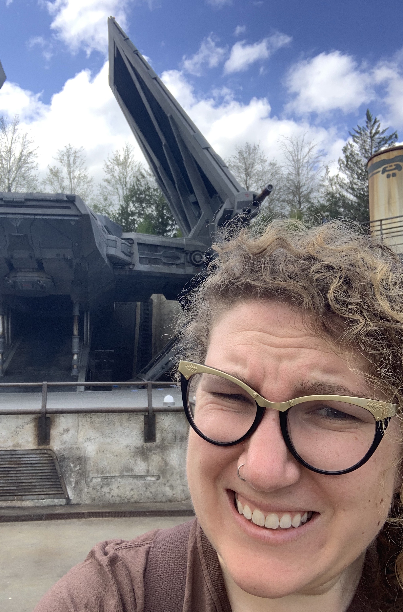
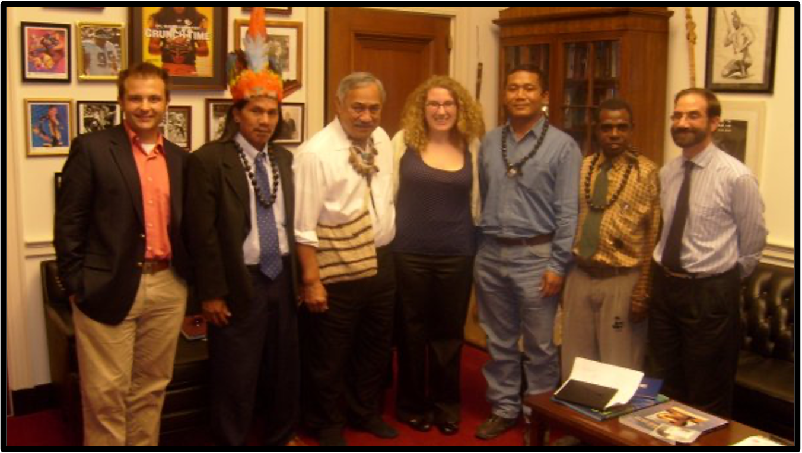
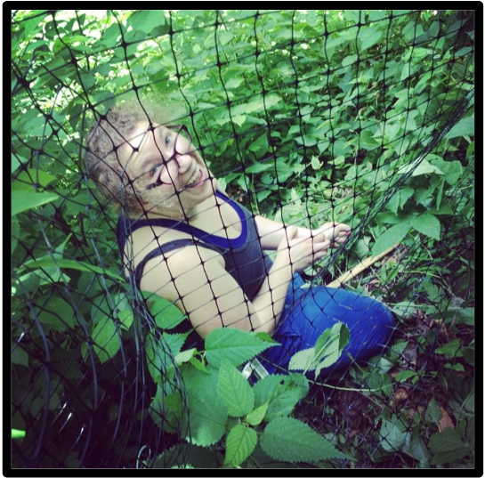
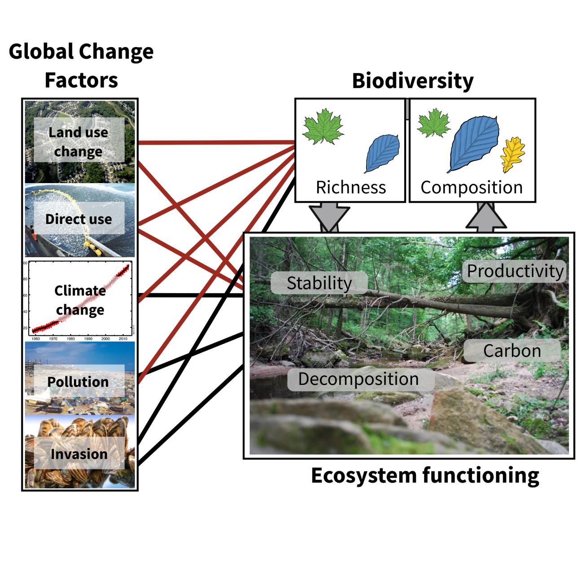
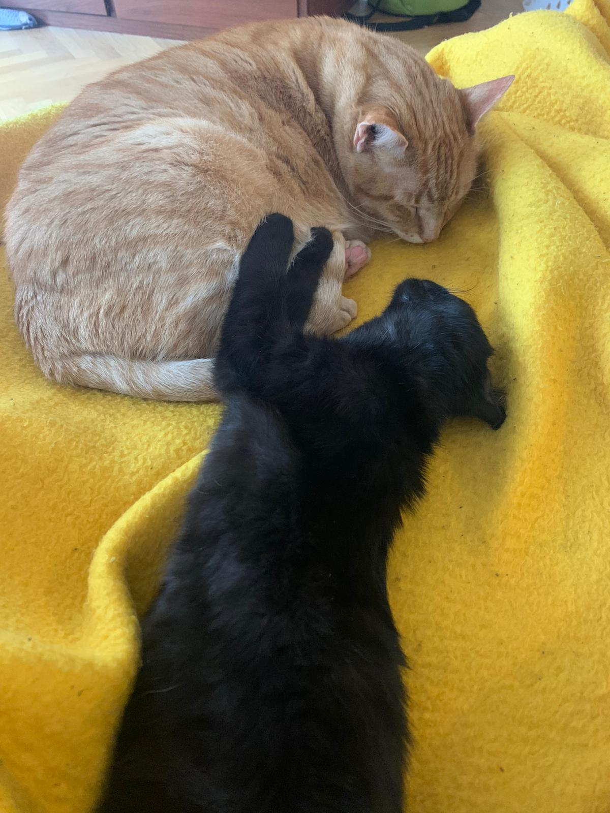
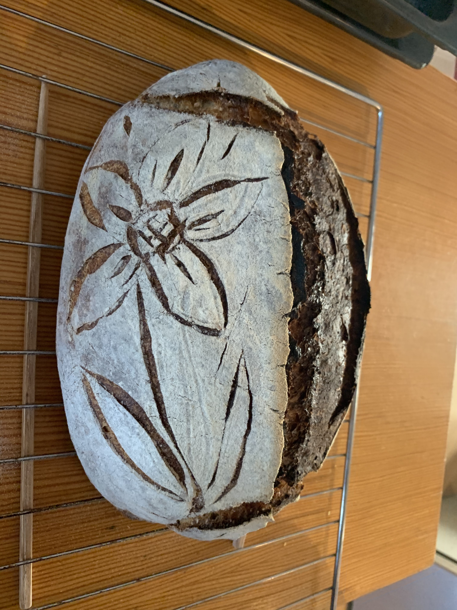

```{r setup, include=FALSE}
knitr::opts_chunk$set(echo = TRUE)
```

# About me
## Katie Barry 


I am 33 and originally from New Jersey in the United States. I grew up in an area of New Jersey that is almost completely dedicated watershed for the rest of the state but also happens to be home to one of the most polluted toxic waste sites in the US! This environmental justice situation led me to get a degree in Environmental Policy at Rutgers university. 



You can see me here as a lobbyist working in Washington, D.C. with a group of indigenous rights activists in support of the UN Draft Declaration on Indigenous Rights and the Act to Save America's Forests. But I realized while I was working that most environmental laws are backed up by solid science in the US. So I decided to get a PhD in Quantative Ecology at the University of Wisconsin. 


I've been living in Germany as a postdoctoral researcher for almost 5 years now! 

## My scientific interests 

I am interested in the consequences that global change has on diversity and on how ecosystems function. I really like to look at this as a full complex system. 



In this complex system - global change affects everything! It affects how species are able to coexist, the amount of functioning that an ecosystem provides, and the interactions between everything. 

## My experience with R 

When I started my PhD, I had never even heard of R and I had only had a single statistics course which involved no practical work! I've been teaching myself R for 9 years now. The most important thing I have learned is that there are tons of ways to do everything, nothing is ever as black and white as it seems, and how to effectively google my problems away. 

## My hobbies 

I spend the majority of my time hanging out with my cats, Remus and Percy (both named after Harry Potter characters). 



I love to bake sourdough and paint and occasionally combine the two! 



I also love to go hiking and spend a lot of time reading an absurd amount of fantasy novels. 

